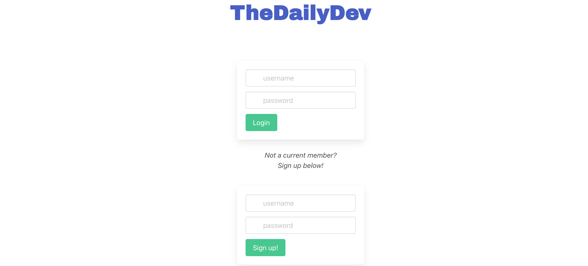
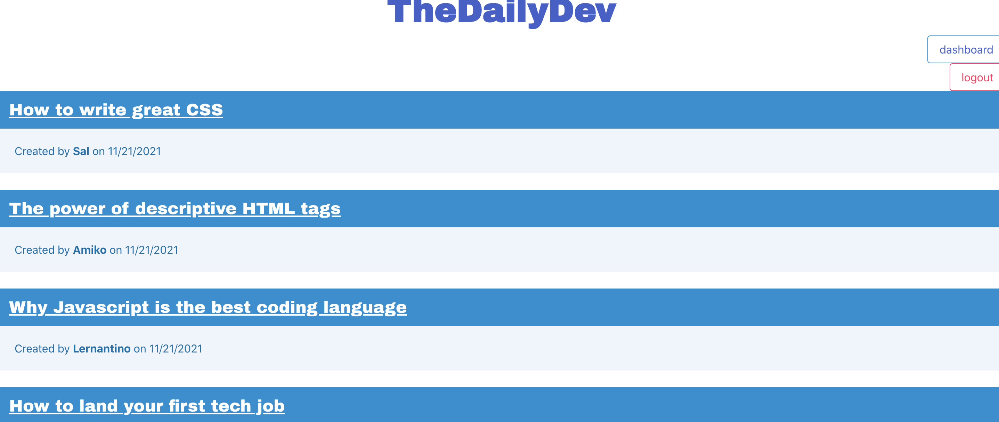
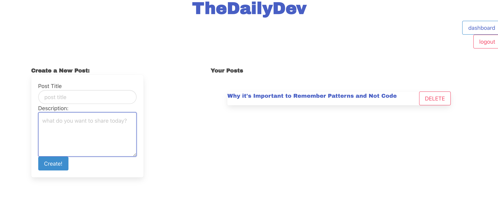
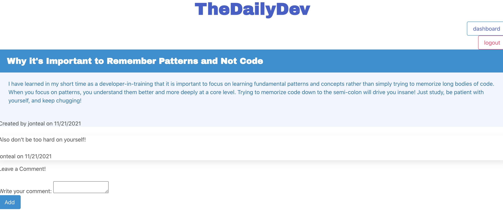

* Application loads with no errors.

* Application GitHub URL submitted.

* GitHub repository contains application code.


* The URL of the functional, deployed application.

* The URL of the GitHub repository, with a unique name and a readme describing the project.


# The Daily Dev - Tech Blog

<a name="description"></a>
<!--  Added description -->
## Description
The purpose of this blog is to be a hub of technology and web development information for developers and coders to have a place to share information about technical concepts, recent advancements, and new technologies. Visitors to the site are able to read and digest the work of others, and if they so wish, can become members and create posts and contribute to the conversation of their community.  


[](https://opensource.org/licenses/MIT)

## Table of Contents
- [Description](#description)
- [User Story](#userstory)
- [Acceptance Criteria](#acceptancecriteria)
- [Installation](#installation)
- [Usage](#usage)
- [License](#license)
- [Contributing](#contributing)
- [Tests](#tests)
- [Questions](#questions)
- [Video](#video)
- [Screenshots](#screenshots)
- [Links](#links)
- [Resources / Credits](#credits)


<a name="userstory"></a>

## User Story

```md
AS A developer who writes about tech
I WANT a CMS-style blog site
SO THAT I can publish articles, blog posts, and my thoughts and opinions
```

<a name="acceptancecriteria"></a>

## Acceptance Criteria

```md
GIVEN a CMS-style blog site
WHEN I visit the site for the first time
THEN I am presented with the homepage, which includes existing blog posts if any have been posted; navigation links for the homepage and the dashboard; and the option to log in
WHEN I click on the homepage option
THEN I am taken to the homepage
WHEN I click on any other links in the navigation
THEN I am prompted to either sign up or sign in
WHEN I choose to sign up
THEN I am prompted to create a username and password
WHEN I click on the sign-up button
THEN my user credentials are saved and I am logged into the site
WHEN I revisit the site at a later time and choose to sign in
THEN I am prompted to enter my username and password
WHEN I am signed in to the site
THEN I see navigation links for the homepage, the dashboard, and the option to log out
WHEN I click on the homepage option in the navigation
THEN I am taken to the homepage and presented with existing blog posts that include the post title and the date created
WHEN I click on an existing blog post
THEN I am presented with the post title, contents, post creator’s username, and date created for that post and have the option to leave a comment
WHEN I enter a comment and click on the submit button while signed in
THEN the comment is saved and the post is updated to display the comment, the comment creator’s username, and the date created
WHEN I click on the dashboard option in the navigation
THEN I am taken to the dashboard and presented with any blog posts I have already created and the option to add a new blog post
WHEN I click on the button to add a new blog post
THEN I am prompted to enter both a title and contents for my blog post
WHEN I click on the button to create a new blog post
THEN the title and contents of my post are saved and I am taken back to an updated dashboard with my new blog post
WHEN I click on one of my existing posts in the dashboard
THEN I am able to delete or update my post and taken back to an updated dashboard
WHEN I click on the logout option in the navigation
THEN I am signed out of the site
WHEN I am idle on the site for more than a set time
THEN I am able to view comments but I am prompted to log in again before I can add, update, or delete comments
```

<a name="installation"></a>

## Installation
* Clone the repository using:

```
git clone https://github.com/jonteal/tech-blog
```
* Be sure that you are in the current working directory
* Create a .env file. (See below in Usage for how to set up.)
* Install the dependencies (bcrypt, connect-session-sequelize, express-handlebars, express, dotenv, mysql2, and sequelize) by opening the terminal and running...
```
npm install OR npm i
```
* In the terminal, log into the MySql by typing
```
mysql -u root -p
```
* Then type in your password for MySql. Once logged in, you will need to source the schema file in the db folder. In order to do that, type in the following in the terminal and hit enter afterwards. 
```
SOURCE db/schema.sql;
```
* Once the schema file is sourced, type 'exit' in the command line and get out of mysql.
* The next step is to run the seed data in order to populate the database. To do that, run the following in the command line.
```
npm run seed
```
* Next, run the project by typing the following command in the terminal:
```
npm run start OR node server.js OR npm run dev (for nodemon)
```

<a name="usage"></a>

## Usage
* In order to use the application, the user can either run the program on their localhost port or access the application via the deployed Heroku link (included below).

* To access via their localhost port, once they have their server running by following the instructions in the previous section, they just need to go to their localhost:3001 (3001 is the port already in place on the server.js file), and the application will run from there. Note - if using the application via localhost, the user will need to create a .env file and create in order to access the application. In the .env file, they will need the following:

```
DB_NAME=brightideas_db
DB_USER=(user-name)
DB_PASSWORD=(user-password)
```

* To access via the deployed link at Heroku, see link below.

* Once the application is running, the user only needs to sign up with their username and chosen password. Once logged in, they'll be on the homepage, displaying all users' blog posts. From here, they can go view and comment on any blog post simply by clicking the title of a post and being navigated to that post.

* The user can also go to their dashboard where they can create their own blog posts by following the instructions. If they wish, they may delete their own posts at any time as well.  

* At any time, the user can logout of the website. A user does not need to be logged in to read the posts on the site.


<a name="license"></a>

## License
Permission is hereby granted, free of charge, to any person obtaining a copy of this software and associated documentation files (the "Software"), to deal in the Software without restriction, including without limitation the rights to use, copy, modify, merge, publish, distribute, sublicense, and/or sell copies of the Software, and to permit persons to whom the Software is furnished to do so, subject to the following conditions:

The above copyright notice and this permission notice shall be included in all copies or substantial portions of the Software.

THE SOFTWARE IS PROVIDED "AS IS", WITHOUT WARRANTY OF ANY KIND, EXPRESS OR IMPLIED, INCLUDING BUT NOT LIMITED TO THE WARRANTIES OF MERCHANTABILITY, FITNESS FOR A PARTICULAR PURPOSE AND NONINFRINGEMENT. IN NO EVENT SHALL THE AUTHORS OR COPYRIGHT HOLDERS BE LIABLE FOR ANY CLAIM, DAMAGES OR OTHER LIABILITY, WHETHER IN AN ACTION OF CONTRACT, TORT OR OTHERWISE, ARISING FROM, OUT OF OR IN CONNECTION WITH THE SOFTWARE OR THE USE OR OTHER DEALINGS IN THE SOFTWARE.


<a name="contributing"></a>

## How to Contribute
1. [Fork the repo!](https://docs.github.com/en/get-started/quickstart/fork-a-repo)
2. Create a feature branch:
```
git checkout -b yourname-branch
```
3. Commit changes:
```
git commit -m 'Your changes here'
```
4. Push to the branch:
```
git push origin yourname-branch
```
5. Submit a pull request and wait for it to be approved or denied.

<a name="tests"></a>

## Tests
No tests available at this time.


<a name="questions"></a>

## Questions
If you have any questions or comments, please feel free to contact me by email:

* Jon Jackson - jonjacksonvibes@gmail.com


<a name="video"></a>

## Video

<a name="screenshots"></a>

## Screenshots


#### Login Page


#### Home Page


#### Project Page


#### Blog Post


<a name="links"></a>

## Links
Github Repository: https://github.com/jonteal/tech-blog

Heroku Live Link: Heroku: 


<a name="credits"></a>

## Resources / Credits
This project was authored by: 
* Jon Jackson - https://github.com/jonteal

Development of the project utilized npm dependencies: bcrypt, connect-session-sequelize, dotenv, express, express-handlebars, express-session, mysql2, nodemon, and sequelize.